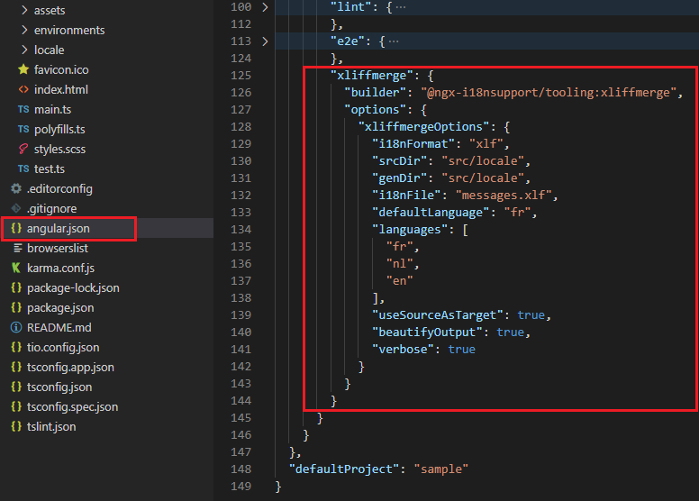
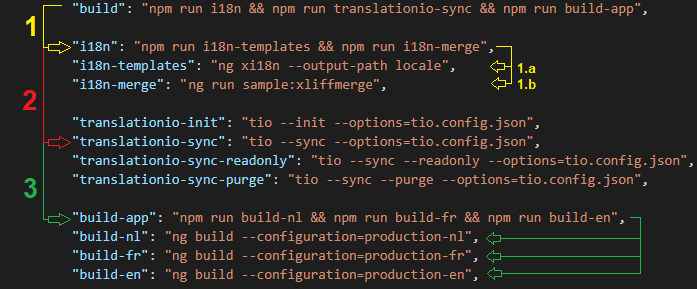

# Translation.io for Angular

Add this package to localize your Angular application.<br />

Il permet de simplifier la traduction des fichiers XLIFF 1.2 en passant par une interface **simple** et **épurée**.<br />
Aucune modification des fichiers XLIFF n'est nécessaire.<br />

Ce package fonctionne avec les versions récentes d'Angular. <br />
Il a été testé avec les versions 6, 7, 8 & 9.<br />
Il supporte uniquement les versions XLIFF 1.2.

Si vous avez besoin de plus d'informations sur l'internationalisation, veuillez consulter la [documentation officielle](https://angular.io/guide/i18n).


## Table of contents
* [Avant de commencer](#avant-de-commencer)
    * [$localize (Angular 10)](#$localize-angular-10)
    * [Xliffmerge](#xliffmerge)
    * [Générer les fichiers XLIFF](#générer-les-fichiers-XLIFF)
* [Type de traduction](#type-de-traduction)
* [Installation](#installation)
* [Configuration](#configuration)
* [Usage](#usage)
    * [Init](#init)
    * [Sync](#sync)
    * [Sync & Purge](#sync-&-purge)
    * [Sync & Readonly](#sync-&-readonly)
* [Exemple](#exemple)
* [License](#license)

<br />

## Avant de commencer

### $localize (Angular 10)
> La fonction "$localize" a été introduit en Angular 9 mais la commande permettant d'extraire les traducitons ("ng xi18n") ne permet pas l'extractions des traductions présentes dans le typescript avant la version Angular 10. Il n'est donc pas conseillé d'utiliser la fonction "$localize" en Angular 9 avec le package ngx-translation-io. <br />Plus d'informations [ici](https://github.com/angular/angular/pull/32912).

Afin de bénéficier de toutes les fonctionnalités liées à l'internationalisation fourni par Angular, n'oubliez pas d'ajouter le package [localize](https://angular.io/guide/i18n#add-the-localize-package) à votre solution :
```bash
ng add @angular/localize
```

### Xliffmerge
Il est nécessaire d'utiliser le package [xliffmerge](https://www.npmjs.com/package/@ngx-i18nsupport/ngx-i18nsupport) afin de générer correctement et facilement les différents fichiers de traductions nécessaires au bon fonctionnement de ce package.

Si vous desirez des explications détaillées sur l'installation du package, veuillez consulter son [wiki](https://github.com/martinroob/ngx-i18nsupport/wiki/Tutorial-for-using-xliffmerge-with-angular-cli).

##### Installation
```bash
ng add @ngx-i18nsupport/tooling --i18nLocale=fr --languages fr,en,nl
```

##### Why ?
Pour éviter de faire cette partie de la documentation officielle à la main :
- https://angular.io/guide/i18n#create-the-translation-files

Once the package is installed, you'll have to add some configuration file in the "angular.json" file <br />

Fichier : 'angular.json' <br />


Voici les options obligatoires à configurer pour le package xliffmerge :
```json
{
  "xliffmergeOptions": {
    "i18nFormat": "xlf",
    "srcDir": "src/locale",
    "genDir": "src/locale",
    "i18nFile": "messages.xlf",
    "defaultLanguage": "fr",
    "languages": ["fr", "nl", "en"],
    "useSourceAsTarget": true,
    "beautifyOutput": true
  }
}
```
La propriété "languages" est la seule propriétée qui doit réellement être modifiée en fonction de votre configuration :
- `languages` : Les différentes langues de votre site
    - Exemples : 
        - le site est en français, anglais et néerlandais ===> ["fr", "en", "nl"]
        - le site est en anglais et espagnol ===> ["en", "es"]
- `i18nFile` : Le nom du fichier généré par la commande "i18n-templates"

### Générer les fichiers XLIFF
Pour utiliser le package ngx-translation-io, il faut posséder les différents fichier XLIFF. <br />
**Un fichier XLIFF par langue.**

Afin de générer ces fichiers, il y a deux étapes :
1. Générer le fichier de traductions de base avec la commande que fourni Angular (xi18n) ===> "i18n-template".
2. Pour chaque langue de votre site, générer le bon fichier de traduction XLIFF avec le package [xliffmerge](#xliffmerge) ===> "i18n-merge"

Pour ce faire, il suffit d'ajouter ces commandes dans le package.json de votre Angular application
```json
    "i18n-templates": "ng xi18n --output-path src/locale",
    "i18n-merge": "ng run sample:xliffmerge",
```
- `i18n-templates` : Cette commande permet de générer le fichier de traduction en fonction des balises i18n présentes dans votre site
- `i18n-merge` : Grâce au fichier précedemment créé par "i18n-template", cette commande permet de générer, pour chaque langues, le bon fichier de traduction. <br /> 'sample' = name of your angular project configured in the "angular.json" file.

et de les exécuter, dans cet ordre, grâce à une commande commune :
```json
    "i18n": "npm run i18n-templates && npm run i18n-merge",
```

<br />

## Type de traduction

Il est important de savoir qu'il y a deux types de traductions sur Translation.io. <br />
Une traduction de type "KEY" et une traduction de type "SOURCE".

Si vous décidez d'utiliser les tags "i18n" avec des [id personnalisés](https://angular.io/guide/i18n#set-a-custom-id-for-persistence-and-maintenance),
c'est que vous dirigez vers l'approche de type "KEY".

#### Key 
- Il se base sur un id que vous lui donnez.
- Cet id doit obligatoirement commencer par l'*[i18n_key](#configuration)*
- Pour modifier le contenu "Hello key", il faut obligatoirement utiliser l'interface graphique Translation.io.
- Exemple :
```html
    <div i18n="@@TIO_MYAPP_HelloKey">Hello key</div>
```

A partir d'Angular 10 :
```js 
    $localize`:@@TIO_MYAPP_HelloKeyJS: Hello key from JS`
```
>Attention : Si vous ne commencez pas vos [id personnalisés](https://angular.io/guide/i18n#set-a-custom-id-for-persistence-and-maintenance) 
par l'*[i18n_key](#configuration)*, vos traductions seront traitées comme étant des traductions de type **"SOURCE"** et non de type **"KEY"**.

#### Source
- Il se base sur son contenu, son texte.
- Aucun id ne doit être spécifié, il suffit de mettre le tag "i18n".
- Pour modifier le contenu "Hello source", il suffit de changer le texte présent dans la balise.
    -   Une fois modifiée, la source devient alors une "nouvelle" traduction qu'il faut aller traduire dans Translation.io
- Exemple
```html
    <div i18n>Hello source</div>
```

A partir d'Angular 10 :
```js
    $localize `Hello source from JS`
```

<br />

## Installation

Une fois que vous avez vos fichiers de traductions, il suffit d'installer le package NPM et de le [configurer](#configuration)

```bash
npm i @corellia/ngx-translation-io@latest
```

<br />

## Configuration

Go to your Translation.io account page and create a new project.
Once the project is created, you'll have to create a configuration file in the root folder of your Angular app

Fichier : 'tio.config.json'
```json
{
    "api_key": "YOUR API KEY",
    "i18n_key": "TIO",
    "source_language": {
        "language": "fr-BE",
        "file": "./src/locale/messages.fr.xlf"
    },
    "target_languages": [
        {
            "language": "en",
            "file": "./src/locale/messages.en.xlf"
        },
        {
            "language": "nl-BE",
            "file": "./src/locale/messages.nl.xlf"
        }
    ]
}
````
- `api_key` : La clé API votre projet Translation.io
- `i18n_key` : Préfix à utiliser pour chaque traduction qui utilise le système "KEY".<br /> Si le préfix n'est pas correct ou indiqué, la traduction est définie comme type "SOURCE"
    ```html
        <div i18n="@@TIOHelloWorld"></div>      <!-- GOOD   ->  Traduction de type "KEY" -->
        <div i18n="@@Goodbye"></div>            <!-- WRONG  ->  Traduction de type "SOURCE" -->
        <div i18n="@@TI_O_Goodbye"></div>       <!-- WRONG  ->  Traduction de type "SOURCE" -->
    ```
- `source_language` : La configuration de la source, c'est à dire, la langue princpale du site. Il faut renseigner le code de la langue et l'emplacement du fichier correspondant.
    - `language` : Le code de la langue source. (Le code doit être le même que celui indiqué dans Translation.io)
    - `file` : Where is located your source XLIFF file
- `target_languages` : La configuration des targets, c'est à dire, les autres langues du site. Pour chaque target, Il faut renseigner le code de la langue et l'emplacement du fichier correspondant.
    - `language` : Le code de la langue target. (Le code doit être le même que celui indiqué dans Translation.io)
    - `file` : Where is located your target XLIFF file


#### Proxy

Il est possible de définir un proxy, pour cela, rien de plus simple :

Fichier : 'tio.config.json'
```json
{
    "api_key": "aaaaaaaaaaaaaaaaaaaaaaaaaaaaaaab",
    "i18n_key": "TIO",
    .
    .
    .
    "proxy": "http://1.1.1.1:8080"
}
```

<br />

## Usage

#### Init

Itialize your project and push existing translations to Translation.io with:

```bash
npm run tio --init --options=tio.config.json
```
Cette commande est, en principe, utilisé qu'une seule fois par projet. Elle permet d'initialiser les traductions existantes dans Translation.io.<br />
Pour toutes les autres actions, voir le SYNC

#### Sync

To send new translatable keys/strings and get new translations from Translation.io, simply run:

```bash
npm run tio --sync --options=tio.config.json
```

> Pour les nouvelles traductions, il sera nécessaire de faire deux Syncs.
>   - Le premier Sync va envoyer les nouvelles traductions sur Translation.io
>   - Une fois que c'est traduit sur le site, le deuxième Sync va récupérer les traductions

#### Sync & Purge

If you need to remove unused keys/strings from Translation.io, using the current application as reference.

```bash
npm run tio --sync --purge --options=tio.config.json
```

As the name says, this operation will also perform a sync at the same time.

Warning : all keys that are not present in the current application will be **permanently deleted from Translation.io**.

#### Sync & Readonly

Si vous avez besoin de synchroniser sans modifier les données présentes dans Translation.io

```bash
npm run tio --sync --readonly --options=tio.config.json
```
La librairie va récupérer les traductions existantes sans 
- ajouter les nouveaux segments
- mettre à jours les segments présents

<br />

## Exemple

### Init d'un projet
Dés que vous avez [vos fichiers XLIFF](#générer-les-fichiers-XLIFF), il ne reste plus qu'à initialiser votre projet Translation.io

Pour cela, il suffit de lancer une commande :
-   elle va [générer les fichiersx XLIFF](#générer-les-fichiers-XLIFF)
-   et [initialiser] le projet sur Translation.io
```bash
npm run translationio-init
```
Fichier : 'package.json' <br />


<br />

### Mettre à jour un projet
Pour mettre à jour les traductions, c'est très simple :

Il suffit de lancer une commande :
-   elle va [générer les fichiersx XLIFF](#générer-les-fichiers-XLIFF)
-   et [synchroniser] les nouvelles traductions et/ou modifications avec Translation.io
```bash
npm run translationio-sync
```
Fichier : 'package.json' <br />


<br />

### Build complet d'une APP en plusieurs langues
Voici un exemple complet pour build une application dans chaque langue.

Il suffit de lancer une commande :
-   elle va [générer les fichiersx XLIFF](#générer-les-fichiers-XLIFF)
-   [synchroniser] avec Translation.io
-   et build le projet avec les différentes traductions récupérées
```bash
npm run build
```
Fichier : 'package.json' <br />


>*N'oubliez pas de configurer le fichier "angular.json" avec les differentes configurations par langue pour pour que l'exemple fonctionne. <br /> Vous pouvez trouver un exemple complet dans le projet "sample" du repository.

<br />

## Licence

The MIT License (MIT). Please see [License File](LICENSE) for more information.